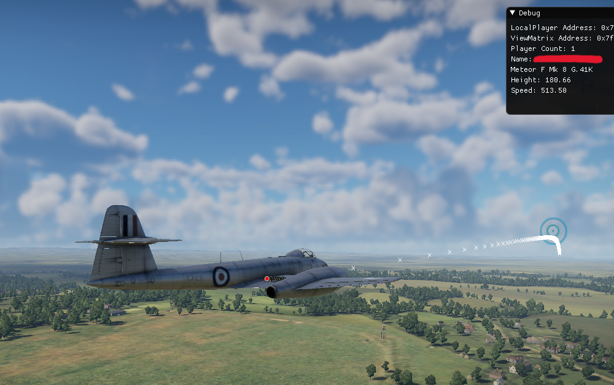

# WarThunder-Projectile Simulation
A simple simulation program (without graphics) showing how **War Thunder** simulates projectile motion with drag applied. You will need to use the projectile values related to your specific vehicle as most of them have different speed, mass etc.

## Features
- **Projectile Motion Simulation**: Models the trajectory of a projectile based on user-defined initial conditions (velocity, angle, etc.).
- **Drag Calculation**: Implements drag forces to simulate realistic motion.
- **Physics Accuracy**: Includes real-world constants (e.g., gravity) and equations for ballistic coefficient and drag constant.
- **Customizable Parameters**: Adjust velocity, launch angle, and other parameters to explore various scenarios.

